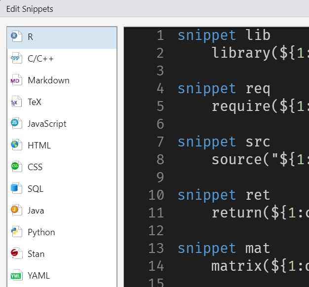

```{r setup, include=FALSE}
options(htmltools.dir.version = FALSE)
```

```{r xaringan-themer, include=FALSE, warning=FALSE}
library(tidyverse)
library(reticulate)
library(xaringanthemer)
style_duo_accent(
  text_font_size = "1.3rem",
  footnote_font_size = "0.6em",
  footnote_position_bottom = "20px",
  # background_color = "#000000",
  # primary_color = "#FFCD00",
  # secondary_color = "#00558C",
  # text_bold_color = "#00558C",
  text_color = "#000",
  # inverse_header_color = "#bbbdbc",
  code_font_google   = google_font("Fira Mono")
)
```

class: center, middle

# The University of **Iowa**


## Statistics and Actuarial Science

---
class: center, middle

# Why RMarkdown?

---
<iframe width="1300" height="600" src="https://www.youtube.com/embed/s3JldKoA0zw?version=3&rel=0" frameborder="0" allow="accelerometer; encrypted-media; gyroscope; picture-in-picture" allowfullscreen></iframe>
---
class: center, middle

# We use them in our daily life..

---

# **R**Markdown packages

.pull-left[

* [**Bookdown**](https://bookdown.org/yihui/bookdown/) - pdf, epub, or html book

  * Writing a gitbook like [Prof. Tierney](http://homepage.stat.uiowa.edu/~luke/classes/STAT7400-2021/_book/index.html)

* [**Blogdown**](https://bookdown.org/yihui/blogdown/) - Static website builder Hugo wrapper

  * Personal website like [me](theissaclee.com)

  * Theme: Academy, Apero (is developing by Rstudio)

* [**Pagedown**](https://pagedown.rbind.io/): single html document generation. a.k.a. goodbye LaTeX?

]
.pull-right[

* [**Distill**](https://rstudio.github.io/distill/): if you really like minimalizm.

  * Concept is developed by Google, package developed by Rstudio.
  * Suitible for academic writing

* [**Xaringan**](https://slides.yihui.org/xaringan/#1): Presentation

  *  Like the one you're looking at.

  * `xaringan themer` - Easy theme for `xaringan` 
  
* [**Thesisdown**](https://github.com/ismayc/thesisdown): Thesis with Rmd.

]
---

class: center, middle

# Use them wisely!

# Useful 3 tips!

---
# Use **R**markdown as **Python**down!

* R package `reticulate` allows us to use Rmarkdown for handling `python`.

  * https://rstudio.github.io/reticulate/index.html

.pull-left[

* Use `python` code chunk in your `.Rmd` file!

````markdown
`r ''````{r}
library(reticulate)
```

`r ''````{python}
import numpy
import pandas

```
````

]
.pull-right[

]

---
# Shortcuts!

`Alt` + `Shift` + `K` shows all shortcuts! However, some are USEFUL, some are **NOT**!

### Useful **Shortcuts!**

.pull-left[

add `%>%` operator: `Ctrl` + `Shift` + `m`

add `<-` operator: `Alt` + -

add cursors! : `Ctrl` + `Alt` + down or up

search functions: `Ctrl` + .

search commands: `Ctrl` + `Shift` + `p`

]
.pull-right[

Run current chunk: `Ctrl` + `Alt` + `c`

R code re-formatting: `Ctrl` + `Shift` + `a`

Copy current below: `Shift` + `Alt` + down

Insert `R` code chunk: `Ctrl` + `Alt` + i

]

---
class: center, middle

# However, so many syntax tho..

---

# Including images

.pull-left[

Should I type all of these to insert just a picture?

````markdown
`r ''````{r chunkname, 
            fig.cap="picture caption",
            fig.align="center",
            out.width="50%"}
knitr::include_graphics("question.png")
```
````
]

.pull-right[

```{r echo=FALSE, out.width="50%", fig.align='center', fig.cap="picture caption"}

```

]
---
# Tables

.pull-left[

Should I memorize all these options for generating table?

````markdown
`r ''````{r}
knitr::kable(head(as.tibble(mtcars[,1:3]), 5), 
             position = "!h",
             col.names = c("col1", "col2", "col3"),
             caption = "caption", 
             align = "lrc", booktab = TRUE)
```
````
]

.pull-right[
```{r echo=FALSE, warning=FALSE, message=FALSE}
# cars is a built-in-to-R data set of cars
knitr::kable(head(as.tibble(mtcars[,1:3]), 5), 
             position = "!h",
             col.names = c("col1", "col2", "col3"),
             caption = "caption", 
             align = "lrc", booktab = TRUE)
```

]

---
# Snippet will **save** you

**Snippet** save your time, almost 1 year during your whole life, no joke.

.pull-left[
### What the hack is snippet
* **Text macros** that are used for quickly inserting common snippets of code

* `Tools` > `Global option` > `Code` > `Snippet`

* Some people know there are *code snippet* in Rstudio

]
.pull-right[

```{r snippet, echo=FALSE, fig.cap="Available snippets languages", fig.align='center', out.width = '80%'}

```

]

---
class: center, middle, inverse

# Live demo

---


---
class: center, middle, inverse

# Thanks!

Slides created via the R package [**xaringan**](https://github.com/yihui/xaringan).

The chakra comes from [remark.js](https://remarkjs.com), [**knitr**](http://yihui.name/knitr), and [R Markdown](https://rmarkdown.rstudio.com).
